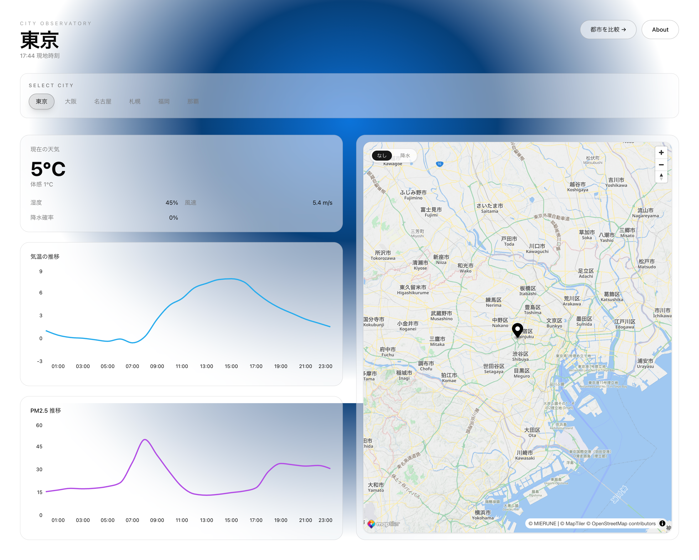
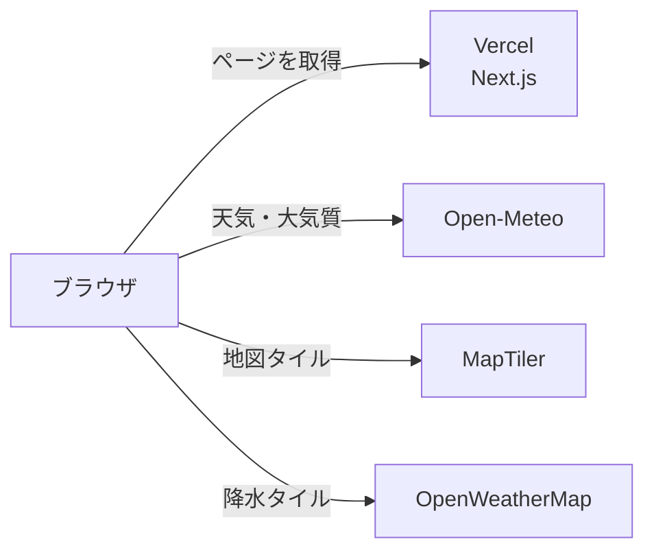

# City Observatory

日本の主要6都市の天気と大気質を1画面で可視化する Web アプリケーション。
数値を並べるのではなく、観測値・時系列グラフ・地図を1枚の記録紙として並べ、都市の状態を一目で読み取れることを設計の軸に置いている。



本番URL: https://city-observatory.vercel.app/

## 📱 画面

| 画面 | パス       | 内容                                    |
| ---- | ---------- | --------------------------------------- |
| 観測 | `/`        | 1都市の観測値・24時間の推移グラフ・地図 |
| 比較 | `/compare` | 2都市の観測値を差の列つきで並べた表     |

対象は東京・大阪・名古屋・札幌・福岡・那覇の6都市。
機能の詳細は[要件定義書](docs/requirements.md)にある。

## 🗺 システム構成

バックエンドを持たない。外部 API はブラウザから直接呼ぶ。



API キーが `NEXT_PUBLIC_` で始まるのはこのため。キーは MapTiler 側の Allowed HTTP Origins で保護する。

## 🛠 技術スタック

Next.js 16（App Router）/ React 19 / TypeScript / Tailwind CSS v4 / TanStack Query / MapLibre GL / Recharts / Zod / Vitest / Playwright

バージョンを含む全量と構成は[技術仕様書](docs/technical-specifications.md)にある。

## 📦 セットアップ

### 前提

- Node.js 20.9 以上（Next.js 16 の要件）
- pnpm 10 以上

### 手順

```bash
git clone https://github.com/nemonsoon/city-observatory-web.git
cd city-observatory-web

pnpm install

# API キーを設定する。必要な変数は .env.example に書いてある
cp .env.example .env.local

pnpm dev
```

http://localhost:3000 で起動する。

MapTiler と OpenWeatherMap の API キーが必要になる。取得先は [`.env.example`](.env.example) に書いてある。

### コマンド

```bash
pnpm dev         # 開発サーバーを起動
pnpm build       # プロダクションビルド
pnpm start       # プロダクションサーバーを起動
pnpm test        # Vitest でユニットテストを実行
pnpm test:e2e    # Playwright で画面を確認
pnpm typecheck   # 型チェック
pnpm lint        # ESLint
pnpm lint:fix    # ESLint の自動修正
pnpm format      # Prettier の書式チェック
pnpm format:fix  # Prettier の自動整形
```

## 📚 ドキュメント

- [要件定義書](docs/requirements.md) - 機能要件・非機能要件・スコープ外。何を作ったのか全体像から知りたいときに最初に読む
- [技術仕様書](docs/technical-specifications.md) - 技術スタック・ディレクトリ構成・データの流れ・デプロイ。構成を変えるときに読む
- [API 仕様書](docs/api-specifications.md) - 外部 API の呼び出し方・エラー対応・クレジット表記。データ取得まわりを触るときに読む
- [デザインシステム](DESIGN.md) - 配色・書体・余白・動きの規約。画面を作る・直すときに読む
- [コーディング規約](docs/coding-guidelines.md) - TypeScript・React・命名の約束事。コードを書く前に読む
- [拡張機能仕様書](docs/enhancement-specifications.md) - 実装済み機能の詳細と未実装の候補。どこまでできているか知りたいときに読む

環境変数は [`.env.example`](.env.example) が正典。

## 🔄 開発フロー（Issue駆動）

1. Issue を立てる
2. `main` から `issue-<number>-<slug>` でブランチを切る（例: `issue-10-map-view`）
3. 実装してコミットし、push する
4. PR を出す。タイトルは `Issue #<number>: <短いタイトル>`、本文に `Closes #<number>` を含める
5. マージ後、`main` を更新して次の Issue に移る

PR の本文は [PR テンプレート](.github/pull_request_template.md)を使う。

```bash
# Issue からブランチを作る
gh issue develop <number> -b issue-<number>-<slug>

# PR を作る
gh pr create -t "Issue #<number>: <title>" -b "Closes #<number>"
```

## 🙏 謝辞

- [Open-Meteo](https://open-meteo.com/) - 天気・大気質データ
- [MapTiler](https://www.maptiler.com/) - 地図タイル
- [OpenStreetMap](https://www.openstreetmap.org/copyright) - 地図データ
- [OpenWeather](https://openweathermap.org/) - 降水レイヤー
- [shadcn/ui](https://ui.shadcn.com/) - UIコンポーネント
