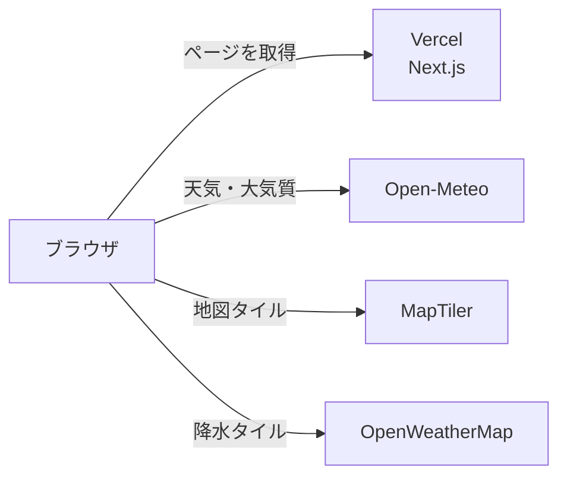

# City Observatory

日本の主要6都市の天気と大気質を1画面で可視化する Web アプリケーション。
数値を並べるのではなく、観測値・時系列グラフ・地図を1枚の記録紙として並べ、都市の状態を一目で読み取れることを設計の軸に置いている。


本番URL: https://city-observatory.vercel.app/

## できること

| 画面 | パス       | 内容                                    |
| ---- | ---------- | --------------------------------------- |
| 観測 | `/`        | 1都市の観測値・24時間の推移グラフ・地図 |
| 比較 | `/compare` | 2都市の観測値を差の列つきで並べた表     |

対象は東京・大阪・名古屋・札幌・福岡・那覇の6都市。

何を作るか、何を作らないかは[要件定義書](docs/requirements.md)が正典。

## 設計

バックエンドを持たない。外部 API はブラウザから直接呼ぶ。



API キーが `NEXT_PUBLIC_` で始まるのはこのため。キーは MapTiler 側の Allowed HTTP Origins で保護する。

層の責務と、層をまたぐデータの流れは[技術仕様書](docs/technical-specifications.md)が正典。

## 技術スタック

Next.js 16（App Router）/ React 19 / TypeScript / Tailwind CSS v4 / TanStack Query / MapLibre GL / Recharts / Zod / Vitest / Playwright

バージョンを含む全量は[技術仕様書](docs/technical-specifications.md)が正典。

## セットアップ

### 前提

- Node.js 20.9 以上（Next.js 16 の要件）
- pnpm 10 以上

### 手順

```bash
git clone https://github.com/nemonsoon/city-observatory-web.git
cd city-observatory-web

pnpm install

# API キーを設定する。必要な変数は .env.example に書いてある
cp .env.example .env.local

pnpm dev
```

http://localhost:3000 で起動する。

MapTiler と OpenWeatherMap の API キーが必要になる。必要な変数と取得先は [`.env.example`](.env.example) が正典。

日々叩くコマンドと、変更を出すまでの手順は[開発手順](docs/development.md)にある。

## ドキュメント

| 文書                                                 | いつ読むか                                           |
| ---------------------------------------------------- | ---------------------------------------------------- |
| [要件定義書](docs/requirements.md)                   | 何を作ったのか、どこまでが対象外かを知りたいとき     |
| [技術仕様書](docs/technical-specifications.md)       | 構成・データの流れ・デプロイを変えるとき             |
| [API 仕様書](docs/api-specifications.md)             | 外部 API の呼び出しや失敗時の扱いを触るとき          |
| [デザインシステム](DESIGN.md)                        | 画面を作るとき・直すとき                             |
| [コーディング規約](docs/coding-guidelines.md)        | コードを書く前                                       |
| [開発手順](docs/development.md)                      | コマンドを叩くとき・変更を出すとき                   |
| [拡張機能仕様書](docs/enhancement-specifications.md) | どこまでできているか、次に何を足せるかを知りたいとき |

環境変数は [`.env.example`](.env.example) が正典。

## 謝辞

- [Open-Meteo](https://open-meteo.com/) - 天気・大気質データ
- [MapTiler](https://www.maptiler.com/) - 地図タイル
- [OpenStreetMap](https://www.openstreetmap.org/copyright) - 地図データ
- [OpenWeather](https://openweathermap.org/) - 降水レイヤー
- [shadcn/ui](https://ui.shadcn.com/) - UIコンポーネント
