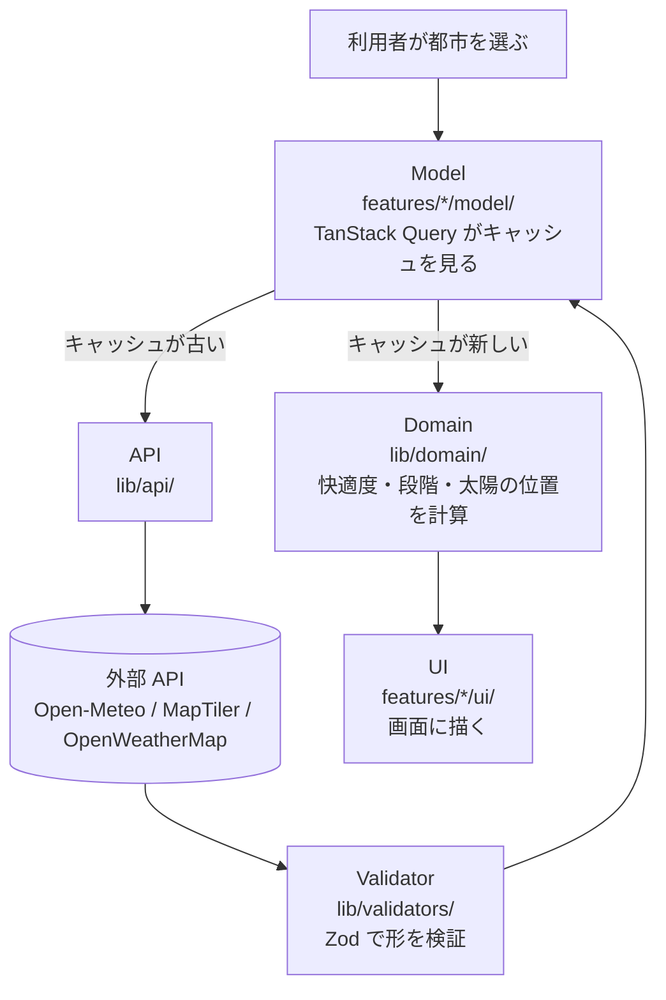

# City Observatory - 技術仕様書

[← README に戻る](../README.md)

技術スタックとディレクトリ構成、層をまたぐデータの流れ、デプロイ設定。

関連する正典は次のとおり。ここには複製しない。

- 環境変数: [`.env.example`](../.env.example)
- 外部 API の呼び出し方・エラー対応・クレジット表記: [API 仕様書](api-specifications.md)
- 色・書体・余白の規約: [デザインシステム](../DESIGN.md)
- コードの書き方: [コーディング規約](coding-guidelines.md)

## 1. 技術スタック

バージョンは `package.json` の指定をそのまま載せている。

### 1.1 コア

| 技術                 | バージョン | 用途                     |
| -------------------- | ---------- | ------------------------ |
| Next.js (App Router) | 16.3.4     | React フレームワーク     |
| React                | 19.2.8     | ユーザーインターフェース |
| TypeScript (strict)  | ^6.0.3     | 型安全な開発             |
| pnpm                 | 10.34.5    | 依存関係管理             |

### 1.2 スタイリング

| 技術                     | バージョン | 用途                                |
| ------------------------ | ---------- | ----------------------------------- |
| Tailwind CSS             | ^4         | ユーティリティファースト CSS        |
| shadcn/ui (new-york)     | —          | `components/ui/button.tsx` のみ採用 |
| class-variance-authority | ^0.7.1     | バリアント管理                      |
| clsx                     | ^2.1.1     | クラス名の組み立て                  |
| tailwind-merge           | ^3.6.0     | クラス名の衝突解決                  |
| tw-animate-css           | ^1.4.0     | アニメーションのユーティリティ      |
| next-themes              | ^0.4.6     | 明暗2配色の切り替え                 |

書体とトークンの定義は [デザインシステム](../DESIGN.md) にある。

### 1.3 データ・状態管理

| 技術           | バージョン | 用途                         |
| -------------- | ---------- | ---------------------------- |
| TanStack Query | ^5.102.8   | サーバー状態管理・キャッシュ |
| jotai          | ^2.20.3    | グローバル状態（最小限）     |
| zod            | ^4.5.4     | スキーマバリデーション       |

### 1.4 地図・可視化

| 技術         | バージョン | 用途              |
| ------------ | ---------- | ----------------- |
| maplibre-gl  | ^5.24.0    | 地図描画（WebGL） |
| recharts     | ^3.10.1    | グラフ描画        |
| lucide-react | ^1.39.0    | アイコン          |

### 1.5 開発・品質

| 技術                   | バージョン | 用途                               |
| ---------------------- | ---------- | ---------------------------------- |
| eslint                 | ^9.39.5    | 静的解析                           |
| prettier               | ^3.9.6     | コードフォーマット                 |
| husky                  | ^9.1.7     | Git hooks                          |
| lint-staged            | ^17.4.1    | ステージ済みファイルの自動チェック |
| vitest                 | ^4.1.11    | ユニットテスト                     |
| @testing-library/react | ^16.3.3    | コンポーネントのテスト             |
| @playwright/test       | ^1.62.1    | 画面の確認（E2E）                  |

## 2. アーキテクチャ

### 2.1 ディレクトリ構成（Feature-Sliced Design）

```
city-observatory-web/
├── app/                          # Next.js App Router
│   ├── layout.tsx                # ルートレイアウト（フォント読み込み、providers）
│   ├── page.tsx                  # 単一都市の観測画面
│   ├── compare/                  # 2都市の比較画面
│   ├── providers.tsx             # TanStack Query + Jotai
│   ├── globals.css               # Tailwind v4 + デザイントークン
│   ├── not-found.tsx
│   ├── opengraph-image.tsx       # OGP 画像の生成
│   ├── robots.ts, sitemap.ts
│
├── features/                     # 機能単位（FSD）
│   ├── air-quality/
│   │   ├── model/use-air-quality-data.ts
│   │   └── ui/air-quality-card.tsx, aq-chart.tsx, aq-chart-client.tsx
│   ├── derived-metrics/
│   │   └── ui/comfort-summary-card.tsx, outdoor-risk-card.tsx
│   ├── map/
│   │   └── ui/map-view.tsx, map-view-client.tsx, map-overlay-toggle.tsx
│   └── weather/
│       ├── model/use-weather-data.ts, use-weather-snapshot.ts
│       └── ui/uv-card.tsx, wind-card.tsx, sun-path-band.tsx,
│           weather-chart.tsx, weather-chart-client.tsx, weather-icon.tsx
│
├── components/                   # 共有 UI
│   ├── layout/                   # chart-tabs.tsx, hero-section.tsx, site-footer.tsx
│   ├── ui/                       # panel.tsx, rule.tsx, grid-field.tsx, level-tag.tsx,
│   │                             # observation-cell.tsx, observation-chart.tsx,
│   │                             # theme-toggle.tsx, realtime-clock.tsx,
│   │                             # external-link.tsx, button.tsx（shadcn/ui）
│   └── theme-provider.tsx
│
├── lib/                          # 共有ロジック
│   ├── api/                      # weather, air-quality, errors
│   ├── domain/                   # 純粋関数（comfort-score, observation-level, sun-path 等）
│   ├── hooks/use-city-dashboard.ts  # 1都市分の観測値をまとめて取り出す
│   ├── types/                    # 共有型定義
│   ├── validators/               # Zod スキーマ
│   ├── constants/                # cities.ts, site.ts
│   ├── utils.ts                  # cn() ヘルパー
│   ├── utils/                    # formatting, timezone
│   └── env.ts                    # 環境変数バリデーション
│
├── tests/unit/domain/            # Vitest（純粋関数のテスト）
├── e2e/                          # Playwright（画面の確認）
├── docs/                         # 仕様書
└── public/                       # 静的アセット
```

インポートは `@/*` がプロジェクトルートを指す（`tsconfig.json` で設定）。

### 2.2 レイヤーの責務

| レイヤー  | 場所                              | 責務                                       |
| --------- | --------------------------------- | ------------------------------------------ |
| UI        | `features/*/ui/`, `components/`   | 表示とユーザー操作。計算と通信は持たない   |
| Model     | `features/*/model/`, `lib/hooks/` | データ取得と状態管理（TanStack Query）     |
| API       | `lib/api/`                        | 外部 API との通信                          |
| Validator | `lib/validators/`                 | 受け取った JSON を Zod で検証              |
| Domain    | `lib/domain/`                     | 純粋関数。副作用を持たず単体でテストできる |

### 2.3 データの流れ

外部 API は、サーバーを経由せずブラウザから直接呼ぶ。API キーが `NEXT_PUBLIC_` で始まるのはこのため。



Validator を通す理由は、外部 API の応答が想定と違う形で返ったときに、壊れた値が Domain と UI へ流れ込むのを入口で止めるため。

### 2.4 キャッシュ戦略

| データ種別 | 定義場所                          | staleTime | gcTime | 理由                                |
| ---------- | --------------------------------- | --------- | ------ | ----------------------------------- |
| 既定値     | `app/providers.tsx`               | 5 分      | 10 分  | 個別に指定しないクエリに適用        |
| 天気予報   | `features/weather/model/`         | 15 分     | 既定   | 更新頻度が高い                      |
| 大気質予報 | `features/air-quality/model/`     | 15 分     | 既定   | 更新頻度が高い                      |
| 派生指標   | `lib/hooks/use-city-dashboard.ts` | —         | —      | 取得せず `useMemo` で計算結果を保持 |

失敗時の扱いは [API 仕様書](api-specifications.md) にある。

## 3. デプロイ

| 項目                | 設定                                                                      |
| ------------------- | ------------------------------------------------------------------------- |
| プラットフォーム    | Vercel（Free プラン）                                                     |
| ビルドコマンド      | `pnpm build`                                                              |
| 環境変数            | Vercel Dashboard で Preview と Production を分けて設定                    |
| MapTiler キーの保護 | Allowed HTTP Origins で制限（詳細は [API 仕様書](api-specifications.md)） |
